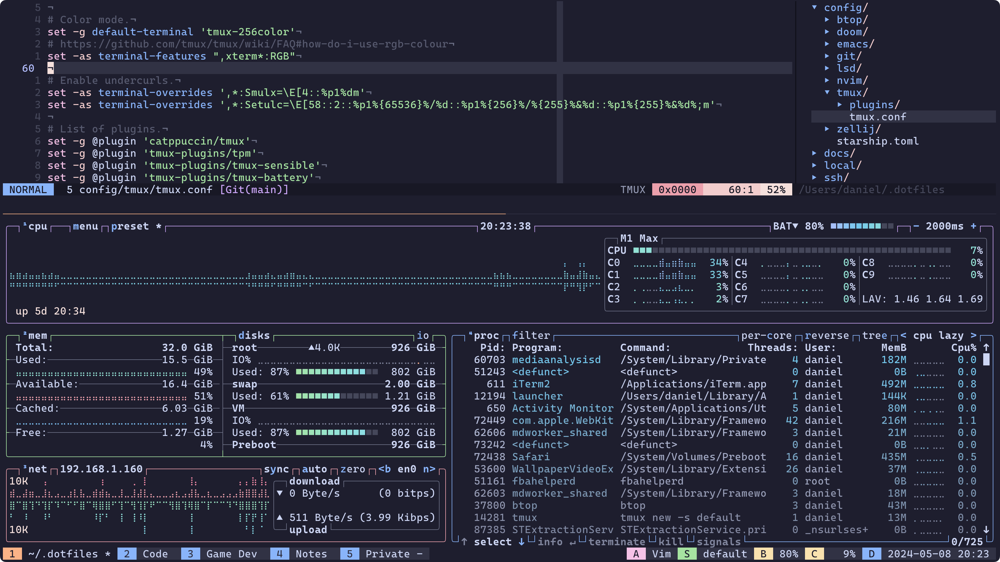

# Dotfiles

These are my dotfiles. There are many like them, but these are mine.



## Installation

Clone this repo into your home directory as `.dotfiles` and run the `install.sh` script:

```
git clone --recursive git://github.com/unindented/dotfiles.git ~/.dotfiles
cd ~/.dotfiles
./install.sh
```

It will symlink the appropriate files in `.dotfiles` to your home directory.

## macOS

If you're on macOS and have [Homebrew](https://brew.sh/) installed, you can run the following to install all the apps declared in `Brewfile`:

```
brew bundle
```

## Meta

- Code: `git clone git@github.com:unindented/dotfiles.git`
- Home: <https://github.com/unindented/dotfiles>

## Contributors

Daniel Perez Alvarez ([daniel@unindented.org](mailto:daniel@unindented.org))

## License

Copyright (c) 2024 Daniel Perez Alvarez ([unindented.org](https://www.unindented.org/)). This is free software, and may be redistributed under the terms specified in the LICENSE file.
