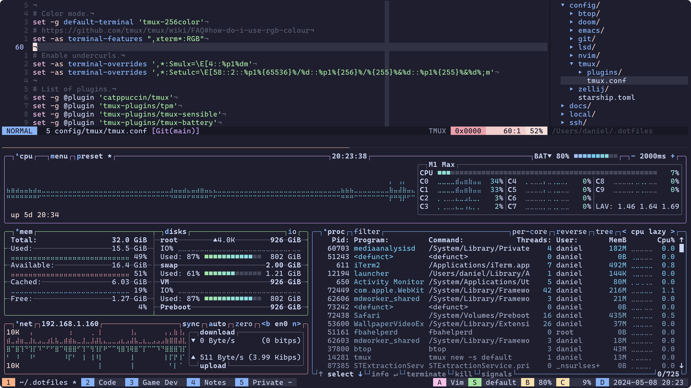

# Dotfiles

These are my dotfiles. There are many like them, but these are mine.



## Installation

### Linux

Clone this repo into your home directory as `.dotfiles`:

```
git clone --recursive git://github.com/unindented/dotfiles.git ~/.dotfiles
```

Install Rust and Cargo via `pacman`:

```
sudo pacman -Syu rustup
rustup default stable
```

Install Tuckr:

```
cargo install --git https://github.com/RaphGL/Tuckr.git
```

Then run Tuckr:

```
tuckr add '*'
```

#### Linux apps

You can run the following to install all the apps declared in `~/.config/pacman/packages.txt`:

```
paru -S (cat ~/.config/pacman/packages.txt)
```

### macOS

Clone this repo into your home directory as `.dotfiles`:

```
git clone --recursive git://github.com/unindented/dotfiles.git ~/.dotfiles
```

Install Rust and Cargo with [`rustup`](https://rust-lang.org/tools/install/):

```
curl --proto '=https' --tlsv1.2 -sSf https://sh.rustup.rs | sh
```

Install Tuckr:

```
cargo install --git https://github.com/RaphGL/Tuckr.git
```

Then run Tuckr:

```
tuckr add '*'
```

#### macOS apps

If you have [Homebrew](https://brew.sh/) installed, you can run the following to install all the apps declared in `~/.config/homebrew/Brewfile`:

```
brew bundle --global
```

#### macOS settings

You can also run the `macos.sh` script to tweak some macOS settings:

```
./macos.sh
```

### Windows

Clone this repo into your `%APPDATA%` directory as `dotfiles`:

```
git clone --recursive --config core.symlinks=true git://github.com/unindented/dotfiles.git $env:APPDATA/dotfiles
```

Install Rust and Cargo with [`rustup-init.exe`](https://rust-lang.org/tools/install/).

After Visual Studio finishes installing, you may need to run the installer again and add two components (MSVC v143 and Windows 11 SDK) as described in [the rustup book](https://rust-lang.github.io/rustup/installation/windows-msvc.html#installing-only-the-required-components-optional).

Install Tuckr:

```
cargo install --git https://github.com/RaphGL/Tuckr.git
```

Then run Tuckr:

```
tuckr add '*'
```

#### Windows apps

You can run the following to install all the apps declared in `%APPDATA%/winget/packages.jsonc`:

```
winget import -i $env:APPDATA/winget/packages.jsonc
```

#### Windows env variables

You may need to tweak you `%PATH%` environment variables. For example, `C:\Program Files\Git\usr\bin` is not added during Git installation, but it contains `file.exe` which is needed by Yazi.

#### Powershell + fzf

To integrate `fzf` into PowerShell, you'll need to install `PSReadline` and `PSfzf`:

```
Install-Module -Name PowerShellGet -Force
Install-Module -Name PSReadLine -Repository PSGallery -Scope CurrentUser -Force
Install-Module -Name PSFzf -Repository PSGallery -Scope CurrentUser -Force
```

## Meta

- Code: `git clone git@github.com:unindented/dotfiles.git`
- Home: <https://github.com/unindented/dotfiles>

## Contributors

Daniel Perez Alvarez ([daniel@unindented.org](mailto:daniel@unindented.org))

## License

Copyright (c) 2026 Daniel Perez Alvarez ([unindented.org](https://www.unindented.org/)). This is free software, and may be redistributed under the terms specified in the LICENSE file.
